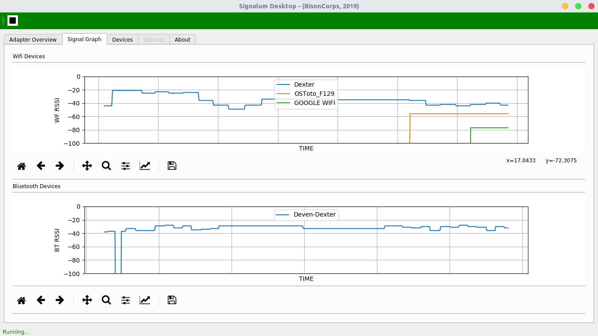
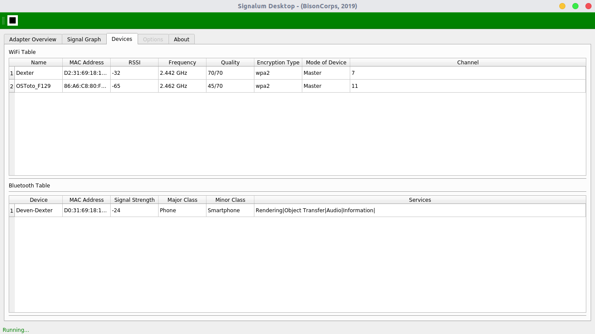
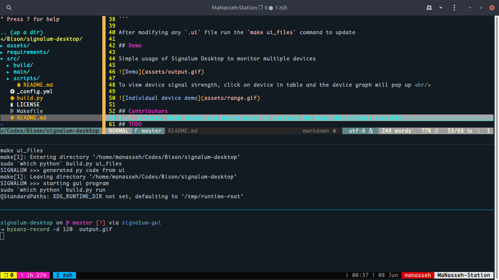

<p align="center">
  <br/>
  <span> <b style="font-size: 40px;">Signalum Desktop</b></span>
</p>
<br>


A Desktop application on the <a href="https://github.com/bisoncorps/signalum" title="Signalum Library/CLI Tool">Signalum Python Library/CLI Tool</a>

This application was bootstrapped with <a href="https://github.com/mherrmann/fbs" title="fbs">Fman Build system</a>
<br> <br>





<br><br>
Written entirely in Python3, Signalum Desktop has been designed for the following scenarios:

- Basic wifi SSID and Bluetooth identification
- Wifi and Bluetooth RSSI Values calculation
- Bluetooth identification
- Export - Ability to export values to excel worksheet


### Development

```bash
  # install dependencies
  make dependencies
```

```bash
  # make ui files and run in development mode
  make dev
```

After modifying any `.ui` file run the `make ui_files` command to update

## Demo

Simple usage of Signalum Desktop to monitor multiple devices



To view device signal strength, click on device in table and the device graph will pop up <br/>


## Contributors

Much thanks and appreciation to everyone who made this project possible

- [Manasseh Mmadu](https//mensaah.github.io)
- [Diretnan Domnan](https://github.com/deven96)
- [Wisdom Praise](https://github.com/wizzywit)
- Engr. Ajao Lukman

## TODO

- [x] Integrate signalum Bluetooth
- [x] Integrate Signalum Wifi
- [x] Bind settings to functions
- [ ] Include adapter details for wifi and bluetooth
- [ ] Add Deployment for Linux and MAC
- [ ] Add Tests and Documentation
